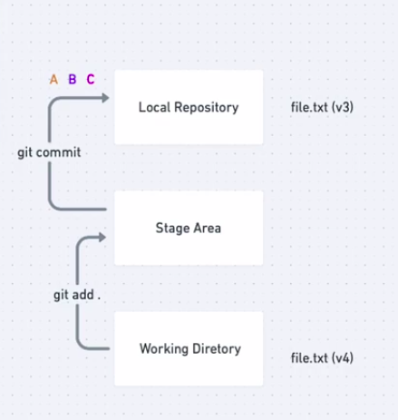

# Git Stages

Git Stages | Git Workflow
:------: | :------: 
 | 

## Iniciando o projeto

Se você está iniciando o trabalho com o git você precisa iniciar o seu repositório primeiro com **git init** onde seu repositório inicializa e com isso você pode utilizar todos os beneficios da ferramenta.

Caso você esteja contribuindo em um projeto open source você pode dar um *fork* no projeto para o seu github e clonar o projeto na web para o seu repositório local usando **git clone <url_do_github>**

Para o git dar conta de gerenciar todo o seu projeto ele basicamente os categoriza em 3 estágios:
- Modified/Created (Working Tree observa o estágio dos arquivos)
- Staged (Staged Area / Stage Tree)
- Commited (Local Repository)

## Working Tree
Também conhecido como **Working Directory** é o local onde fica todos os arquivos do seu repositório local dentro do computador. E por conta dele que o git consegue ter acesso ao seus arquivos para seguir com todo o trabalho.

É dentro desse ponto onde git observa o estado de cada arquivo criado, modificado ou deletado conforme o desenvolvimento do seu projeto.

### Commands

~~~
git status
~~~
> Mostra o estado de cada arquivo dentro do seu repositório local, exibindo tanto os arquivos que foram modificados, deletados ou adicionados recentemente, é muito importante para manter um gerenciamento organizado do seu trabalho.
~~~
git add .
~~~
> Adiciona todos os arquivos que foram modificados ou criados recentemente e registrado os arquivos deletados, com isso esses arquivos passam do estágio de **unstaged** para **staged** para o git isso significa que há arquivos prontos para receber um **commit** ps: O mesmo vale para os comandos seguintes
~~~
git add <file_name>
~~~
> Aqui o git adiciona o arquivo selecionado por seu nome
~~~
git add *.extensão_do_arquivo
~~~
>Nesse o git adiciona todos os arquivos com a extensão selecionada

Esses comandos são responsáveis por mandar os arquivos selecionados para o próximo ponto do workflow do seu trabalho onde o primeiro simplesmente adiciona exatamente todos os arquivos para serem commitados

## Stage Area
Pode ser chamado como **Stage Tree** também, aqui é onde temos os arquivos que estão prontos para serem commitados e salvos dentro do histórico do projeto

### Commands
~~~
git commit -m "meu comentário sobre a modificação"
~~~
> Esse comando salva seu comentário e o adiciona ao repositório local registrando todo o seu trabalho até ali. Para salvar no histórico o git registra um snapshot do seu working tree e com isso é criado um hash único para que você consiga visitar os estados do seu projeto no futuro. Partindo daqui o projeto já está salvo e o arquivo passa para o estágio **commited**

> Você pode acompanhar o seu histórico de trabalho usando o **git log** onde ele exibi cada commit feito junto com seu id de registro e os dados de quem fez a ação.

## Local Repository

É onde fica armazenado o seu projeto dentro da sua máquina antes de ir para algum repositório de código na internet é graças a ele que você consegue acessar todo o histórico do projeto e acompanhar como está sendo realizado o trabalho pelo time de desenvolvimento
